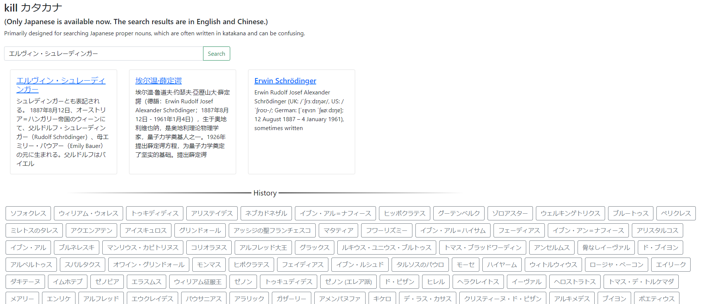

# Sedna
kill katakana

Primarily designed for searching Japanese proper nouns, which are often written in katakana and can be confusing.

TODO: language select

TODO: search history

version 0.1: Search for Katakana and display links to Wikipedia pages in Japanese, English, and Chinese.

